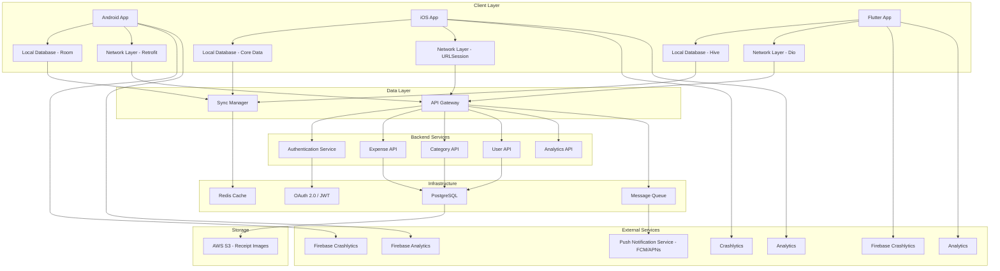
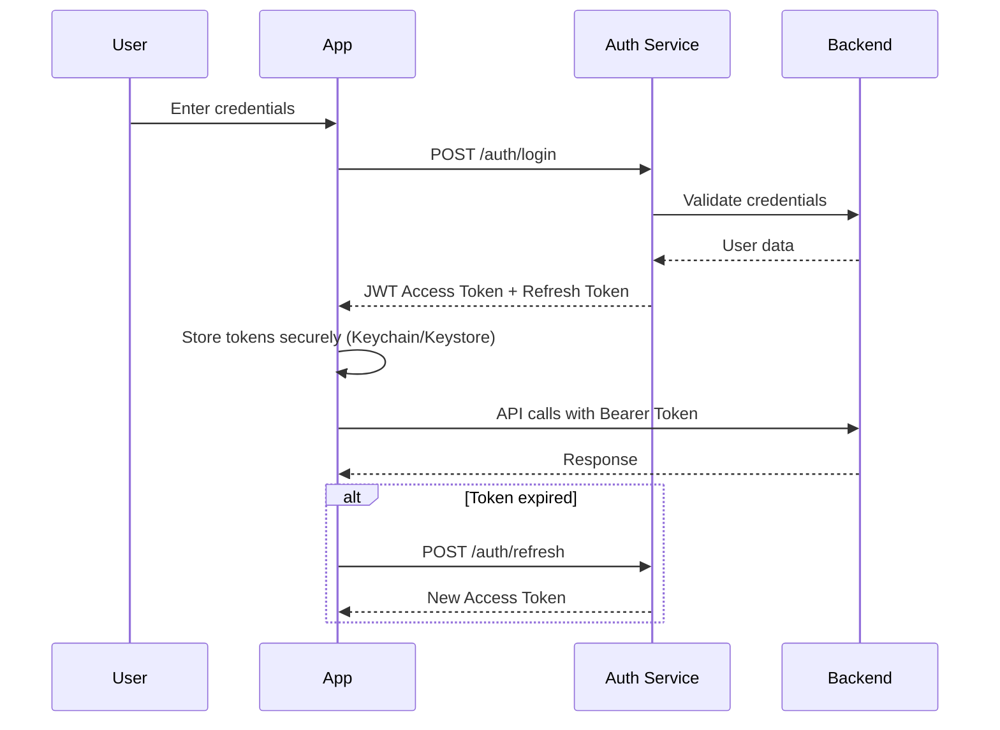
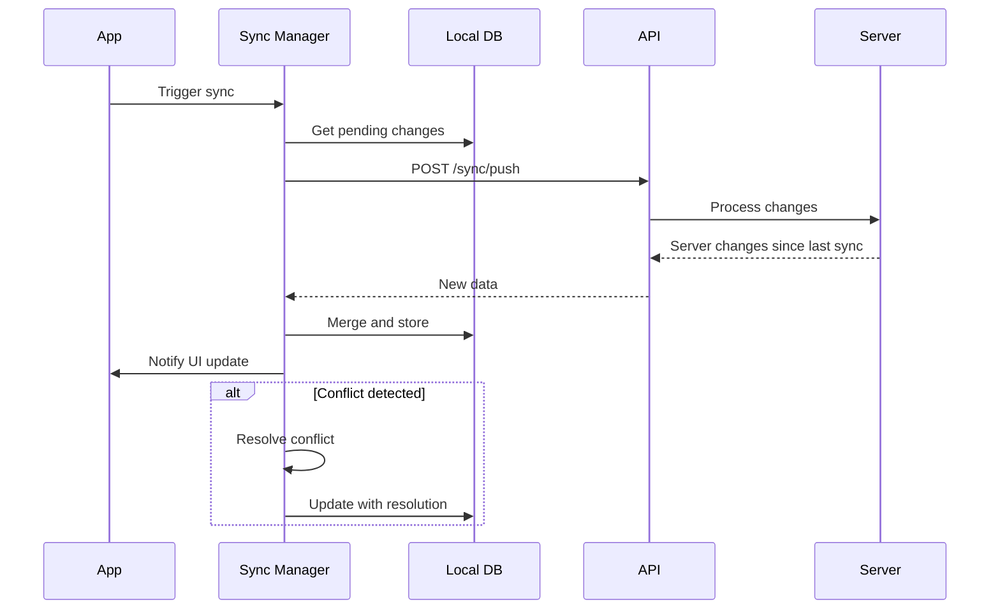
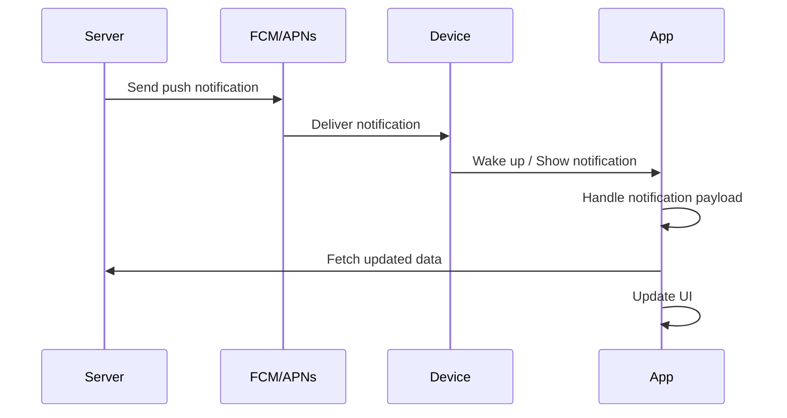

# Part 1: Mobile Solution Architecture

## Smart Expense Manager - Complete Architecture Design

### 1. Overall Architecture

#### Architecture Diagram (Mermaid)



#### Architecture Components

**Mobile Architecture Pattern:**
Clean Architecture with MVVM

- **Presentation Layer**: UI components (Jetpack Compose/SwiftUI/Flutter) + ViewModels/BLoC
- **Domain Layer**: Business logic, use cases, entities
- **Data Layer**: Repository implementations, data sources (API, local DB)
- **Dependency Injection**: Hilt (Android) / custom DI container (iOS) / GetIt (Flutter)

**Backend Interaction:**

- RESTful API with JSON responses
- GraphQL for complex queries (optional)
- WebSocket for real-time sync (optional)
- API Gateway for rate limiting and routing

**Authentication Flow:**



**Local Database Strategy:**

- **Android**: Room Database with SQLite
- **iOS**: Core Data / SwiftData
- **Flutter**: Hive (NoSQL) or SQLite
- **Shared Schema**: Same entity definitions across platforms
- **Data Models**: Expense, Category, User, Receipt, Budget

**Offline-First Strategy:**

1. **Local-First Approach**: All data stored locally first
2. **Optimistic UI**: Update UI immediately, sync in background
3. **Conflict Resolution**: Last-write-wins with timestamps
4. **Queue System**: Operations queued when offline, executed when online
5. **Sync Status**: Indicators showing sync state to users

**Synchronization Mechanism:**



**Sync Algorithm:**

- Incremental sync using timestamps
- Bidirectional synchronization
- Conflict resolution: server wins for critical data, user wins for preferences
- Retry mechanism with exponential backoff
- Batch operations for efficiency

**Push Notification Flow:**



**Push Types**:

- Expense reminders
- Budget alerts
- Sync completion notifications
- Feature announcements

**Analytics Integration:**

- **Android**: Firebase Analytics
- **iOS**: Firebase Analytics / App Analytics
- **Flutter**: Firebase Analytics
- **Events Tracked**:
  - Screen views
  - Feature usage (add expense, categorize, etc.)
  - User flows (onboarding, expense creation)
  - Performance metrics
  - Error events

**Crash Reporting:**

- **Android**: Firebase Crashlytics
- **iOS**: Firebase Crashlytics
- **Flutter**: Firebase Crashlytics
- **Error Tracking**:
  - Crash reports with stack traces
  - Non-fatal errors
  - Custom error logs
  - Device and OS information
  - User context (if available)

---

### 2. Platform Architecture

#### Android Architecture

**Technology Stack:**

- **Language**: Kotlin 1.9+
- **UI Framework**: Jetpack Compose
- **Architecture Pattern**: MVVM with Clean Architecture
- **Dependency Injection**: Hilt
- **Local Database**: Room
- **Networking**: Retrofit + OkHttp
- **Async**: Coroutines + Flow
- **State Management**: StateFlow + SharedFlow
- **Image Loading**: Coil
- **Navigation**: Jetpack Navigation Compose
- **Testing**: JUnit, MockK, Espresso

**Architecture Layers:**

```text
┌─────────────────────────────────────┐
│     Presentation Layer              │
│  ┌───────────────────────────────┐  │
│  │  Composable UI Screens        │  │
│  │  ViewModels                   │  │
│  │  StateFlow/SharedFlow         │  │
│  └───────────────────────────────┘  │
└─────────────────────────────────────┘
              ↓
┌─────────────────────────────────────┐
│       Domain Layer                  │
│  ┌───────────────────────────────┐  │
│  │  Use Cases                    │  │
│  │  Repository Interfaces        │  │
│  │  Domain Models                │  │
│  └───────────────────────────────┘  │
└─────────────────────────────────────┘
              ↓
┌─────────────────────────────────────┐
│        Data Layer                   │
│  ┌───────────────────────────────┐  │
│  │  Repository Implementations   │  │
│  │  Data Sources                 │  │
│  │  - Remote (Retrofit)          │  │
│  │  - Local (Room)               │  │
│  │  - Cache                      │  │
│  └───────────────────────────────┘  │
└─────────────────────────────────────┘
```

**Why These Choices**:

- **Kotlin**: Modern, concise, null-safe, excellent tooling support
- **Jetpack Compose**: Declarative UI, less boilerplate, better performance, modern approach
- **MVVM**: Separates concerns, testable, lifecycle-aware
- **Clean Architecture**: Independent of frameworks, testable, scalable
- **Hilt**: Compile-time DI, type-safe, Android-optimized
- **Room**: Type-safe SQL, compile-time verification, LiveData/Flow support
- **Retrofit**: Type-safe HTTP, easy to use, supports coroutines
- **Coroutines**: Structured concurrency, efficient, readable async code
- **StateFlow**: Lifecycle-aware, state management, reactive

#### iOS Architecture

**Technology Stack:**

- **Language**: Swift 5.9+
- **UI Framework**: SwiftUI
- **Architecture Pattern**: MVVM with Clean Architecture
- **Dependency Injection**: Custom DI container using protocols
- **Local Database**: SwiftData (iOS 17+) or Core Data
- **Networking**: URLSession with async/await
- **Async**: Swift Concurrency (async/await, Task, Actor)
- **State Management**: @State, @Published, @Observable
- **Image Loading**: Kingfisher or AsyncImage
- **Navigation**: SwiftUI Navigation
- **Testing**: XCTest, Swift Mocking

**Architecture Layers:**

```text
┌─────────────────────────────────────┐
│     Presentation Layer              │
│  ┌───────────────────────────────┐  │
│  │  SwiftUI Views                │  │
│  │  ViewModels                   │  │
│  │  @Published Properties        │  │
│  └───────────────────────────────┘  │
└─────────────────────────────────────┘
              ↓
┌─────────────────────────────────────┐
│       Domain Layer                  │
│  ┌───────────────────────────────┐  │
│  │  Use Cases                    │  │
│  │  Repository Protocols         │  │
│  │  Domain Models                │  │
│  └───────────────────────────────┘  │
└─────────────────────────────────────┘
              ↓
┌─────────────────────────────────────┐
│        Data Layer                   │
│  ┌───────────────────────────────┐  │
│  │  Repository Implementations   │  │
│  │  Data Sources                 │  │
│  │  - Remote (URLSession)        │  │
│  │  - Local (SwiftData)          │  │
│  │  - Cache                      │  │
│  └───────────────────────────────┘  │
└─────────────────────────────────────┘
```

**Why These Choices**:

- **Swift**: Type-safe, modern syntax, excellent performance, strong community
- **SwiftUI**: Declarative UI, less code, live previews, modern approach
- **MVVM**: Clear separation, testable, works well with SwiftUI
- **Clean Architecture**: Platform-independent, testable, maintainable
- **SwiftData**: Modern, type-safe, SwiftUI integration, simpler than Core Data
- **URLSession**: Native, no dependencies, async/await support
- **Async/Await**: Modern concurrency, readable, structured concurrency
- **@Published**: Reactive state management, SwiftUI integration

#### Flutter Architecture

**Technology Stack:**

- **Language**: Dart 3.0+
- **UI Framework**: Flutter with Material Design
- **Architecture Pattern**: Clean Architecture with BLoC
- **Dependency Injection**: GetIt
- **Local Database**: Hive (NoSQL) or SQLite
- **Networking**: Dio
- **Async**: async/await, Future, Stream
- **State Management**: Flutter BLoC (Business Logic Component)
- **Image Loading**: cached_network_image
- **Navigation**: GoRouter
- **Testing**: Flutter Test, Mockito

**Architecture Layers:**

```text
┌─────────────────────────────────────┐
│     Presentation Layer              │
│  ┌───────────────────────────────┐  │
│  │  Flutter Widgets             │  │
│  │  BLoC Cubits                 │  │
│  │  State Streams               │  │
│  └───────────────────────────────┘  │
└─────────────────────────────────────┘
              ↓
┌─────────────────────────────────────┐
│       Domain Layer                  │
│  ┌───────────────────────────────┐  │
│  │  Use Cases                    │  │
│  │  Repository Interfaces        │  │
│  │  Domain Entities              │  │
│  └───────────────────────────────┘  │
└─────────────────────────────────────┘
              ↓
┌─────────────────────────────────────┐
│        Data Layer                   │
│  ┌───────────────────────────────┐  │
│  │  Repository Implementations   │  │
│  │  Data Sources                 │  │
│  │  - Remote (Dio)               │  │
│  │  - Local (Hive)               │  │
│  │  - Cache                      │  │
│  └───────────────────────────────┘  │
└─────────────────────────────────────┘
```

**Why These Choices**:

- **Dart**: Type-safe, excellent performance, great tooling, single codebase for multiple platforms
- **Flutter**: Fast development, native performance, hot reload, rich widget library
- **BLoC**: Clear separation of business logic from UI, testable, reactive state management
- **Clean Architecture**: Platform-independent, testable, maintainable
- **Hive**: Fast, lightweight NoSQL database, easy to use, no schema required
- **Dio**: Powerful HTTP client with interceptors, transformers, and error handling
- **Async/Await**: Modern concurrency, readable, similar to other languages
- **GetIt**: Simple service locator, compile-time safety, excellent for DI

---

### 3. Shared Engineering Standards

#### Naming Conventions

**Cross-Platform Rules**:

- Use clear, descriptive names
- Avoid abbreviations unless widely known
- Be consistent across platforms
- Follow platform-specific conventions where applicable

**Android (Kotlin)**:

- Classes: PascalCase (e.g., `ExpenseViewModel`)
- Functions: camelCase (e.g., `getExpenses()`)
- Variables: camelCase (e.g., `expenseAmount`)
- Constants: UPPER_SNAKE_CASE (e.g., `MAX_EXPENSE_AMOUNT`)
- Composables: PascalCase (e.g., `ExpenseListItem`)

**iOS (Swift)**:

- Types: PascalCase (e.g., `ExpenseViewModel`)
- Functions/Methods: camelCase (e.g., `getExpenses()`)
- Variables/Properties: camelCase (e.g., `expenseAmount`)
- Constants: camelCase or UPPER_SNAKE_CASE (e.g., `maxExpenseAmount`)
- SwiftUI Views: PascalCase (e.g., `ExpenseListItem`)

**Flutter (Dart)**:

- Classes: PascalCase (e.g., `ExpenseViewModel`)
- Functions: camelCase (e.g., `getExpenses()`)
- Variables: camelCase (e.g., `expenseAmount`)
- Constants: lowerCamelCase or UPPER_SNAKE_CASE (e.g., `maxExpenseAmount`)
- Widgets: PascalCase (e.g., `ExpenseListItem`)
- Files: snake_case (e.g., `expense_view_model.dart`)

#### API Contracts

**RESTful API Standards**:

- Use nouns for resources (e.g., `/expenses`, `/categories`)
- HTTP methods: GET, POST, PUT, DELETE, PATCH
- Consistent response structure:

```json
{
  "data": { ... },
  "meta": {
    "timestamp": "2024-01-01T00:00:00Z",
    "version": "1.0"
  },
  "errors": []
}
```

- Standard HTTP status codes
- Pagination: `?page=1&limit=20`
- Filtering: `?category=food&date_from=2024-01-01`
- Sorting: `?sort=-date`

**Shared API Models**:

- Define API contracts in OpenAPI/Swagger
- Generate models from spec
- Version APIs: `/api/v1/expenses`
- Use ISO 8601 for dates
- Use decimal strings for currency (avoid floating point)

#### Error Handling

**Standard Error Response**:

```json
{
  "code": "VALIDATION_ERROR",
  "message": "Invalid expense amount",
  "details": {
    "field": "amount",
    "constraint": "min: 0.01"
  }
}
```

**Error Codes**:

- `VALIDATION_ERROR`: 400
- `UNAUTHORIZED`: 401
- `FORBIDDEN`: 403
- `NOT_FOUND`: 404
- `CONFLICT`: 409
- `SERVER_ERROR`: 500

**Android Implementation**:

```kotlin
sealed class AppError {
    data class NetworkError(val message: String) : AppError()
    data class ValidationError(val field: String, val message: String) : AppError()
    data class NotFoundError(val resource: String) : AppError()
    data class ServerError(val code: Int, val message: String) : AppError()
    data class UnknownError(val message: String) : AppError()
}

// Usage in ViewModel
when (result) {
    is Result.Success -> _uiState.value = UiState.Success(result.data)
    is Result.Error -> _uiState.value = UiState.Error(result.error)
}
```

**iOS Implementation**:

```swift
enum AppError: Error {
    case networkError(String)
    case ValidationError(field: String, message: String)
    case NotFoundError(String)
    case ServerError(code: Int, message: String)
    case UnknownError(String)
}

// Usage in ViewModel
switch result {
case .success(let data):
    uiState = .success(data)
case .failure(let error):
    uiState = .error(error)
}
```

**Flutter Implementation**:

```dart
sealed class AppError {
  final String message;
  const AppError(this.message);
}

class NetworkError extends AppError {
  const NetworkError(super.message);
}

class ValidationError extends AppError {
  final String field;
  const ValidationError(this.field, super.message);
}

class NotFoundError extends AppError {
  final String resource;
  const NotFoundError(this.resource, super.message);
}

// Usage in BLoC
emit(state.copyWith(
  status: result.isSuccess 
    ? BlocStatus.success 
    : BlocStatus.failure,
  error: result.error,
));
```

#### Logging

**Log Levels**:

- `VERBOSE`: Detailed debugging
- `DEBUG`: Development information
- `INFO`: General information
- `WARNING`: Warning conditions
- `ERROR`: Error conditions

**Logging Standards**:

- Structured logging where possible
- Include context (user ID, session ID)
- No sensitive data in logs
- Production: INFO and above
- Development: all levels

**Android**: Timber library

```kotlin
Timber.d("Expense created: id=$expenseId, amount=$amount")
```

**iOS**: OSLog

```swift
Logger.debug("Expense created: id=\(expenseId), amount=\(amount)")
```

**Flutter**: logger package

```dart
logger.d('Expense created: id=$expenseId, amount=$amount');
```

#### Analytics

**Standard Events**:

- `screen_view`: Screen name, properties
- `expense_created`: Amount, category, date
- `expense_updated`: Changes made
- `expense_deleted`: Expense ID
- `category_selected`: Category ID
- `filter_applied`: Filter type, value
- `export_triggered`: Export format
- `sync_completed`: Duration, item count

**Android Implementation**:

```kotlin
import com.google.firebase.analytics.FirebaseAnalytics
import com.google.firebase.analytics.ktx.analytics
import com.google.firebase.analytics.ktx.logEvent

private val firebaseAnalytics = Firebase.analytics

fun logExpenseCreated(amount: Double, category: String) {
    firebaseAnalytics.logEvent(FirebaseAnalytics.Event.SELECT_ITEM) {
        param(FirebaseAnalytics.Param.ITEM_ID, "expense")
        param(FirebaseAnalytics.Param.ITEM_NAME, category)
        param("amount", amount)
        param("timestamp", System.currentTimeMillis())
    }
}

fun logScreenView(screenName: String) {
    firebaseAnalytics.logEvent(FirebaseAnalytics.Event.SCREEN_VIEW) {
        param(FirebaseAnalytics.Param.SCREEN_NAME, screenName)
    }
}
```

**iOS Implementation**:

```swift
import FirebaseAnalytics
import FirebaseCore

let analytics = Analytics.analytics()

func logExpenseCreated(amount: Double, category: String) {
    analytics.logEvent("expense_created", parameters: [
        AnalyticsParameterItemID: "expense" as String,
        AnalyticsParameterItemName: category,
        "amount": amount,
        "timestamp": Date().timeIntervalSince1970
    ])
}

func logScreenView(screenName: String) {
    analytics.logEvent(FirebaseAnalyticsEventScreenView, parameters: [
        AnalyticsParameterScreenName: screenName
    ])
}
```

**Flutter Implementation**:

```dart
import 'package:firebase_analytics/firebase_analytics.dart';

class AnalyticsService {
  final FirebaseAnalytics _analytics = FirebaseAnalytics.instance;

  Future<void> logExpenseCreated(double amount, String category) async {
    await _analytics.logEvent(
      name: 'expense_created',
      parameters: {
        'item_id': 'expense',
        'item_name': category,
        'amount': amount,
        'timestamp': DateTime.now().millisecondsSinceEpoch,
      },
    );
  }

  Future<void> logScreenView(String screenName) async {
    await _analytics.logEvent(
      name: 'screen_view',
      parameters: {'screen_name': screenName},
    );
  }
}
```

#### Localization

**Standards**:

- Use localization keys for all user-facing text
- Support English as base language
- Use ICU message format for plurals
- Externalize dates, currencies, numbers
- Test with RTL languages

**Android Implementation**:

```xml
<!-- res/values/strings.xml -->
<resources>
    <string name="expense_amount">Expense Amount</string>
    <string name="add_expense">Add Expense</string>
    <plurals name="expense_count">
        <item quantity="one">%d expense</item>
        <item quantity="other">%d expenses</item>
    </plurals>
</resources>

<!-- Usage in code -->
val expenseAmount = getString(R.string.expense_amount)
val expenseCount = resources.getQuantityString(R.plurals.expense_count, count, count)
```

**iOS Implementation**:

```swift
// Localizable.strings (English)
"expense_amount" = "Expense Amount";
"add_expense" = "Add Expense";
"expense_count" = "%d expense";
"expense_count_plural" = "%d expenses";

// Usage in code
let expenseAmount = NSLocalizedString("expense_amount", comment: "")
let expenseCount = String(format: NSLocalizedString("expense_count", comment: ""), count)
```

**Flutter Implementation**:

```dart
// lib/l10n/app_en.arb
{
  "@locale": "en",
  "expenseAmount": "Expense Amount",
  "addExpense": "Add Expense",
  "expenseCount": "{count} expense",
  "@expenseCount": {
    "plural": "expenseCount",
    "placeholders": {
      "count": {"type": "int"}
    }
  }
}

// Usage in code
text: AppLocalizations.of(context)!.expenseAmount
text: AppLocalizations.of(context)!.expenseCount(count)
```

**Shared Keys**:

- Maintain a shared key document
- Use consistent naming
- Include context in comments

#### Accessibility

**Standards**:

- Minimum touch target: 44x44 points
- Support dynamic type
- VoiceOver labels
- High contrast support
- Color blindness friendly
- Keyboard navigation support

**Implementation**:

**Android Implementation**:

```kotlin
@Composable
fun ExpenseCard(
    expense: Expense,
    onDelete: () -> Unit
) {
    Card(
        modifier = Modifier
            .semantics {
                this.contentDescription = "${expense.category.name} expense, ${expense.amount}, ${expense.date}"
                this.onClick { onDelete() }
            }
            .minimumTouchTargetSize(48.dp),
        onClick = onDelete
    ) {
        // Card content
    }
}
```

**iOS Implementation**:

```swift
struct ExpenseCard: View {
    let expense: Expense
    let onDelete: () -> Void
    
    var body: some View {
        Card {
            // Card content
        }
        .accessibilityLabel("\(expense.category.name) expense, \(expense.amount), \(expense.date)")
        .accessibilityHint("Double tap to delete")
        .accessibilityAddTraits(.isButton)
    }
}
```

**Flutter Implementation**:

```dart
Widget build(BuildContext context) {
  return Semantics(
    label: '${expense.category.name} expense, ${expense.amount}, ${expense.date}',
    hint: 'Double tap to delete',
    button: true,
    child: Card(
      child: InkWell(
        onTap: onDelete,
        child: // Card content
      ),
    ),
  );
}
```

#### Security Standards

**Authentication Implementation**:

**Android Implementation**:

```kotlin
import android.security.keystore.KeyGenParameterSpec
import android.security.keystore.KeyProperties
import java.security.KeyStore
import javax.crypto.Cipher
import javax.crypto.KeyGenerator

class SecureStorage(context: Context) {
    private val keyStore = KeyStore.getInstance("AndroidKeyStore").apply { load(null) }
    
    fun storeToken(token: String) {
        val cipher = Cipher.getInstance(TRANSFORMATION)
        cipher.init(Cipher.ENCRYPT_MODE, getSecretKey())
        val encrypted = cipher.doFinal(token.toByteArray())
        val sharedPreferences = context.getSharedPreferences("secure", Context.MODE_PRIVATE)
        sharedPreferences.edit().putString("auth_token", Base64.encodeToString(encrypted, Base64.DEFAULT)).apply()
    }
    
    fun getToken(): String? {
        val sharedPreferences = context.getSharedPreferences("secure", Context.MODE_PRIVATE)
        val encrypted = sharedPreferences.getString("auth_token", null) ?: return null
        val cipher = Cipher.getInstance(TRANSFORMATION)
        cipher.init(Cipher.DECRYPT_MODE, getSecretKey())
        val decrypted = cipher.doFinal(Base64.decode(encrypted, Base64.DEFAULT))
        return String(decrypted)
    }
}
```

**iOS Implementation**:

```swift
import Security
import CryptoKit

class SecureStorage {
    func storeToken(_ token: String) throws {
        let data = token.data(using: .utf8)!
        let query: [String: Any] = [
            kSecClass as String: kSecClassGenericPassword,
            kSecAttrAccount as String: "auth_token",
            kSecValueData as String: data
        ]
        let status = SecItemAdd(query as CFDictionary, nil)
        guard status == errSecSuccess else { throw KeychainError.unableToStore }
    }
    
    func getToken() throws -> String {
        let query: [String: Any] = [
            kSecClass as String: kSecClassGenericPassword,
            kSecAttrAccount as String: "auth_token",
            kSecReturnData as String: true
        ]
        var result: AnyObject?
        let status = SecItemCopyMatching(query as CFDictionary, &result)
        guard status == errSecSuccess, let data = result as? Data else {
            throw KeychainError.unableToRetrieve
        }
        return String(data: data, encoding: .utf8)!
    }
}
```

**Flutter Implementation**:

```dart
import 'package:flutter_secure_storage/flutter_secure_storage.dart';

class SecureStorage {
  final _storage = const FlutterSecureStorage();

  Future<void> storeToken(String token) async {
    await _storage.write(key: 'auth_token', value: token);
  }

  Future<String?> getToken() async {
    return await _storage.read(key: 'auth_token');
  }

  Future<void> deleteToken() async {
    await _storage.delete(key: 'auth_token');
  }
}
```

**Data Security**:

- HTTPS only
- Certificate pinning
- Encrypt sensitive data at rest
- No hardcoded secrets
- Input validation and sanitization

**Network Security**:

- TLS 1.2+
- Certificate validation
- API key protection
- Request/response encryption for sensitive data

#### Coding Guidelines

**General Principles**:

- SOLID principles
- DRY (Don't Repeat Yourself)
- KISS (Keep It Simple, Stupid)
- YAGNI (You Aren't Gonna Need It)
- Write tests for business logic
- Code reviews mandatory
- Documentation for complex logic

**Code Quality**:

- Maximum function length: 50 lines
- Maximum cyclomatic complexity: 10
- File length: < 500 lines
- Class responsibilities: Single responsibility
- Comment why, not what
- Use meaningful names
- Extract reusable components for duplicated UI patterns
- Use extension methods for common operations
- Centralize business logic in utilities

**Review Checklist**:

- Code follows style guide
- Tests included and passing
- No hardcoded values
- Error handling implemented
- Performance considered
- Security reviewed
- Accessibility checked
