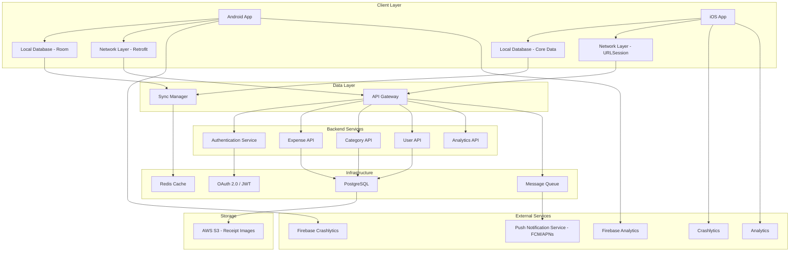
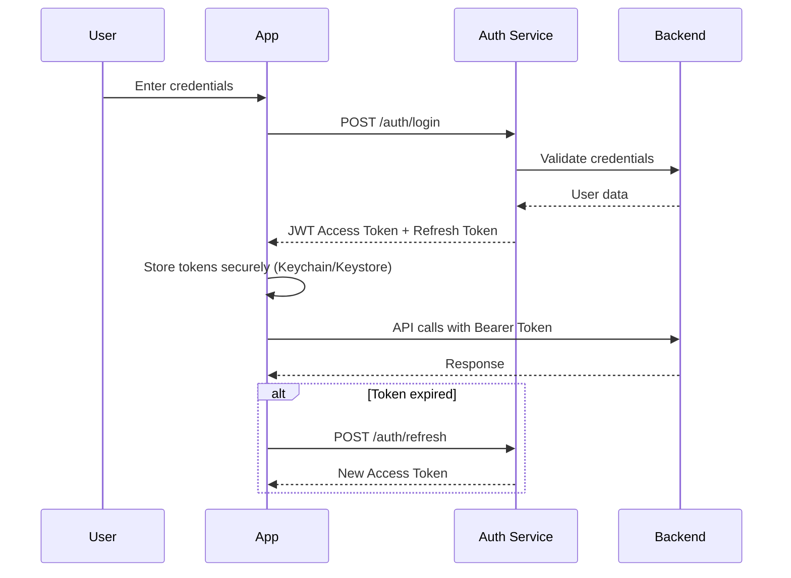
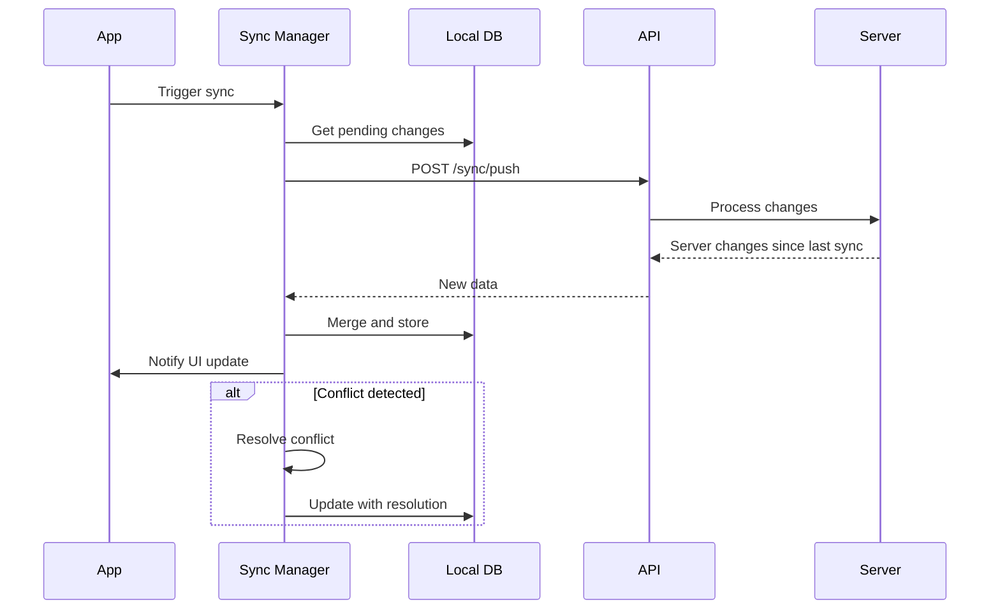
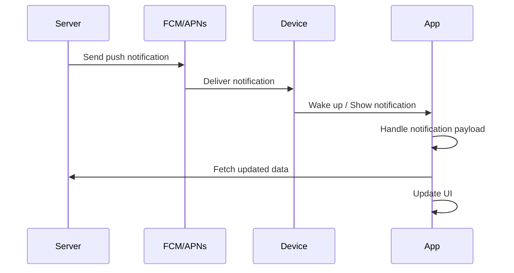

# Part 1: Mobile Solution Architecture

## Smart Expense Manager - Complete Architecture Design

### 1. Overall Architecture

#### Architecture Diagram (Mermaid)



#### Architecture Components

**Mobile Architecture Pattern:**
Clean Architecture with MVVM

- **Presentation Layer**: UI components (Jetpack Compose/SwiftUI) + ViewModels
- **Domain Layer**: Business logic, use cases, entities
- **Data Layer**: Repository implementations, data sources (API, local DB)
- **Dependency Injection**: Hilt (Android) / custom DI container (iOS)

**Backend Interaction:**

- RESTful API with JSON responses
- GraphQL for complex queries (optional)
- WebSocket for real-time sync (optional)
- API Gateway for rate limiting and routing

**Authentication Flow:**



**Local Database Strategy:**

- **Android**: Room Database with SQLite
- **iOS**: Core Data / SwiftData
- **Shared Schema**: Same entity definitions across platforms
- **Data Models**: Expense, Category, User, Receipt, Budget

**Offline-First Strategy:**

1. **Local-First Approach**: All data stored locally first
2. **Optimistic UI**: Update UI immediately, sync in background
3. **Conflict Resolution**: Last-write-wins with timestamps
4. **Queue System**: Operations queued when offline, executed when online
5. **Sync Status**: Indicators showing sync state to users

**Synchronization Mechanism:**



**Sync Algorithm:**

- Incremental sync using timestamps
- Bidirectional synchronization
- Conflict resolution: server wins for critical data, user wins for preferences
- Retry mechanism with exponential backoff
- Batch operations for efficiency

**Push Notification Flow:**



**Push Types**:

- Expense reminders
- Budget alerts
- Sync completion notifications
- Feature announcements

**Analytics Integration:**

- **Android**: Firebase Analytics
- **iOS**: Firebase Analytics / App Analytics
- **Events Tracked**:
  - Screen views
  - Feature usage (add expense, categorize, etc.)
  - User flows (onboarding, expense creation)
  - Performance metrics
  - Error events

**Crash Reporting:**

- **Android**: Firebase Crashlytics
- **iOS**: Firebase Crashlytics
- **Error Tracking**:
  - Crash reports with stack traces
  - Non-fatal errors
  - Custom error logs
  - Device and OS information
  - User context (if available)

---

### 2. Platform Architecture

#### Android Architecture

**Technology Stack:**

- **Language**: Kotlin 1.9+
- **UI Framework**: Jetpack Compose
- **Architecture Pattern**: MVVM with Clean Architecture
- **Dependency Injection**: Hilt
- **Local Database**: Room
- **Networking**: Retrofit + OkHttp
- **Async**: Coroutines + Flow
- **State Management**: StateFlow + SharedFlow
- **Image Loading**: Coil
- **Navigation**: Jetpack Navigation Compose
- **Testing**: JUnit, MockK, Espresso

**Architecture Layers:**

```text
┌─────────────────────────────────────┐
│     Presentation Layer              │
│  ┌───────────────────────────────┐  │
│  │  Composable UI Screens        │  │
│  │  ViewModels                   │  │
│  │  StateFlow/SharedFlow         │  │
│  └───────────────────────────────┘  │
└─────────────────────────────────────┘
              ↓
┌─────────────────────────────────────┐
│       Domain Layer                  │
│  ┌───────────────────────────────┐  │
│  │  Use Cases                    │  │
│  │  Repository Interfaces        │  │
│  │  Domain Models                │  │
│  └───────────────────────────────┘  │
└─────────────────────────────────────┘
              ↓
┌─────────────────────────────────────┐
│        Data Layer                   │
│  ┌───────────────────────────────┐  │
│  │  Repository Implementations   │  │
│  │  Data Sources                 │  │
│  │  - Remote (Retrofit)          │  │
│  │  - Local (Room)               │  │
│  │  - Cache                      │  │
│  └───────────────────────────────┘  │
└─────────────────────────────────────┘
```

**Why These Choices**:

- **Kotlin**: Modern, concise, null-safe, excellent tooling support
- **Jetpack Compose**: Declarative UI, less boilerplate, better performance, modern approach
- **MVVM**: Separates concerns, testable, lifecycle-aware
- **Clean Architecture**: Independent of frameworks, testable, scalable
- **Hilt**: Compile-time DI, type-safe, Android-optimized
- **Room**: Type-safe SQL, compile-time verification, LiveData/Flow support
- **Retrofit**: Type-safe HTTP, easy to use, supports coroutines
- **Coroutines**: Structured concurrency, efficient, readable async code
- **StateFlow**: Lifecycle-aware, state management, reactive

#### iOS Architecture

**Technology Stack:**

- **Language**: Swift 5.9+
- **UI Framework**: SwiftUI
- **Architecture Pattern**: MVVM with Clean Architecture
- **Dependency Injection**: Custom DI container using protocols
- **Local Database**: SwiftData (iOS 17+) or Core Data
- **Networking**: URLSession with async/await
- **Async**: Swift Concurrency (async/await, Task, Actor)
- **State Management**: @State, @Published, @Observable
- **Image Loading**: Kingfisher or AsyncImage
- **Navigation**: SwiftUI Navigation
- **Testing**: XCTest, Swift Mocking

**Architecture Layers:**

```text
┌─────────────────────────────────────┐
│     Presentation Layer              │
│  ┌───────────────────────────────┐  │
│  │  SwiftUI Views                │  │
│  │  ViewModels                   │  │
│  │  @Published Properties        │  │
│  └───────────────────────────────┘  │
└─────────────────────────────────────┘
              ↓
┌─────────────────────────────────────┐
│       Domain Layer                  │
│  ┌───────────────────────────────┐  │
│  │  Use Cases                    │  │
│  │  Repository Protocols         │  │
│  │  Domain Models                │  │
│  └───────────────────────────────┘  │
└─────────────────────────────────────┘
              ↓
┌─────────────────────────────────────┐
│        Data Layer                   │
│  ┌───────────────────────────────┐  │
│  │  Repository Implementations   │  │
│  │  Data Sources                 │  │
│  │  - Remote (URLSession)        │  │
│  │  - Local (SwiftData)          │  │
│  │  - Cache                      │  │
│  └───────────────────────────────┘  │
└─────────────────────────────────────┘
```

**Why These Choices**:

- **Swift**: Type-safe, modern syntax, excellent performance, strong community
- **SwiftUI**: Declarative UI, less code, live previews, modern approach
- **MVVM**: Clear separation, testable, works well with SwiftUI
- **Clean Architecture**: Platform-independent, testable, maintainable
- **SwiftData**: Modern, type-safe, SwiftUI integration, simpler than Core Data
- **URLSession**: Native, no dependencies, async/await support
- **Async/Await**: Modern concurrency, readable, structured concurrency
- **@Published**: Reactive state management, SwiftUI integration

---

### 3. Shared Engineering Standards

#### Naming Conventions

**Cross-Platform Rules**:

- Use clear, descriptive names
- Avoid abbreviations unless widely known
- Be consistent across platforms
- Follow platform-specific conventions where applicable

**Android (Kotlin)**:

- Classes: PascalCase (e.g., `ExpenseViewModel`)
- Functions: camelCase (e.g., `getExpenses()`)
- Variables: camelCase (e.g., `expenseAmount`)
- Constants: UPPER_SNAKE_CASE (e.g., `MAX_EXPENSE_AMOUNT`)
- Composables: PascalCase (e.g., `ExpenseListItem`)

**iOS (Swift)**:

- Types: PascalCase (e.g., `ExpenseViewModel`)
- Functions/Methods: camelCase (e.g., `getExpenses()`)
- Variables/Properties: camelCase (e.g., `expenseAmount`)
- Constants: camelCase or UPPER_SNAKE_CASE (e.g., `maxExpenseAmount`)
- SwiftUI Views: PascalCase (e.g., `ExpenseListItem`)

#### API Contracts

**RESTful API Standards**:

- Use nouns for resources (e.g., `/expenses`, `/categories`)
- HTTP methods: GET, POST, PUT, DELETE, PATCH
- Consistent response structure:

```json
{
  "data": { ... },
  "meta": {
    "timestamp": "2024-01-01T00:00:00Z",
    "version": "1.0"
  },
  "errors": []
}
```

- Standard HTTP status codes
- Pagination: `?page=1&limit=20`
- Filtering: `?category=food&date_from=2024-01-01`
- Sorting: `?sort=-date`

**Shared API Models**:

- Define API contracts in OpenAPI/Swagger
- Generate models from spec
- Version APIs: `/api/v1/expenses`
- Use ISO 8601 for dates
- Use decimal strings for currency (avoid floating point)

#### Error Handling

**Standard Error Response**:

```json
{
  "code": "VALIDATION_ERROR",
  "message": "Invalid expense amount",
  "details": {
    "field": "amount",
    "constraint": "min: 0.01"
  }
}
```

**Error Codes**:

- `VALIDATION_ERROR`: 400
- `UNAUTHORIZED`: 401
- `FORBIDDEN`: 403
- `NOT_FOUND`: 404
- `CONFLICT`: 409
- `SERVER_ERROR`: 500

**Platform Implementation**:

- **Android**: sealed classes for error states
- **iOS**: enum with associated values
- Centralized error handling
- User-friendly error messages
- Logging of technical errors

#### Logging

**Log Levels**:

- `VERBOSE`: Detailed debugging
- `DEBUG`: Development information
- `INFO`: General information
- `WARNING`: Warning conditions
- `ERROR`: Error conditions

**Logging Standards**:

- Structured logging where possible
- Include context (user ID, session ID)
- No sensitive data in logs
- Production: INFO and above
- Development: all levels

**Android**: Timber library

```kotlin
Timber.d("Expense created: id=$expenseId, amount=$amount")
```

**iOS**: OSLog

```swift
Logger.debug("Expense created: id=\(expenseId), amount=\(amount)")
```

#### Analytics

**Standard Events**:

- `screen_view`: Screen name, properties
- `expense_created`: Amount, category, date
- `expense_updated`: Changes made
- `expense_deleted`: Expense ID
- `category_selected`: Category ID
- `filter_applied`: Filter type, value
- `export_triggered`: Export format
- `sync_completed`: Duration, item count

**Event Properties**:

- Consistent naming across platforms
- Use snake_case for property names
- Include relevant context
- No PII in analytics

#### Localization

**Standards**:

- Use localization keys for all user-facing text
- Support English as base language
- Use ICU message format for plurals
- Externalize dates, currencies, numbers
- Test with RTL languages

**Key Format**:

- Android: `R.string.expense_amount`
- iOS: `NSLocalizedString("expense_amount", comment: "")`

**Shared Keys**:

- Maintain a shared key document
- Use consistent naming
- Include context in comments

#### Accessibility

**Standards**:

- Minimum touch target: 44x44 points
- Support dynamic type
- VoiceOver labels
- High contrast support
- Color blindness friendly
- Keyboard navigation support

**Implementation**:

- Semantic labels
- Accessibility hints
- Focus management
- Screen reader testing

#### Security Standards

**Authentication**:

- OAuth 2.0 / JWT
- Secure token storage (Keychain/Keystore)
- Token refresh mechanism
- Biometric authentication where available

**Data Security**:

- HTTPS only
- Certificate pinning
- Encrypt sensitive data at rest
- No hardcoded secrets
- Input validation and sanitization

**Network Security**:

- TLS 1.2+
- Certificate validation
- API key protection
- Request/response encryption for sensitive data

#### Coding Guidelines

**General Principles**:

- SOLID principles
- DRY (Don't Repeat Yourself)
- KISS (Keep It Simple, Stupid)
- YAGNI (You Aren't Gonna Need It)
- Write tests for business logic
- Code reviews mandatory
- Documentation for complex logic

**Code Quality**:

- Maximum function length: 50 lines
- Maximum cyclomatic complexity: 10
- File length: < 500 lines
- Class responsibilities: Single responsibility
- Comment why, not what
- Use meaningful names
- Extract reusable components for duplicated UI patterns
- Use extension methods for common operations
- Centralize business logic in utilities

**Review Checklist**:

- Code follows style guide
- Tests included and passing
- No hardcoded values
- Error handling implemented
- Performance considered
- Security reviewed
- Accessibility checked
